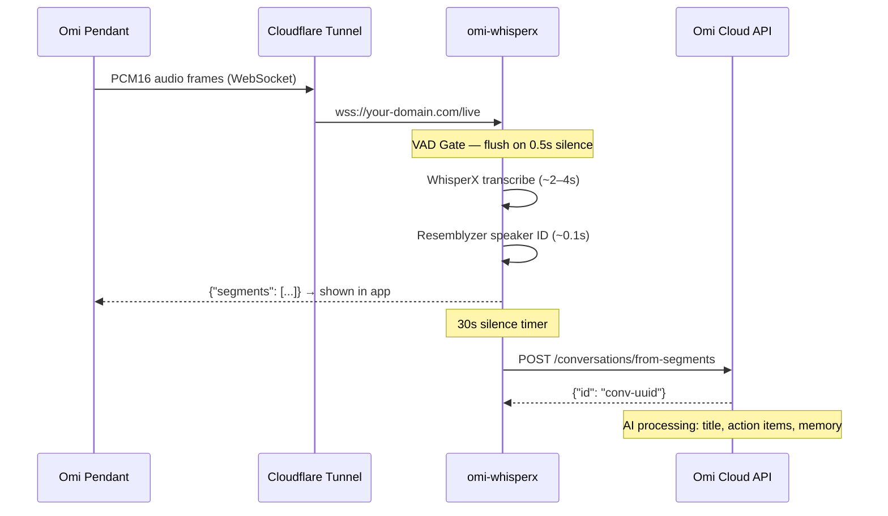
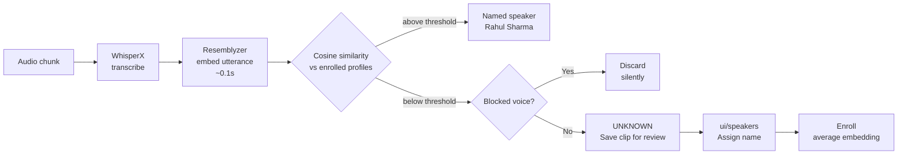
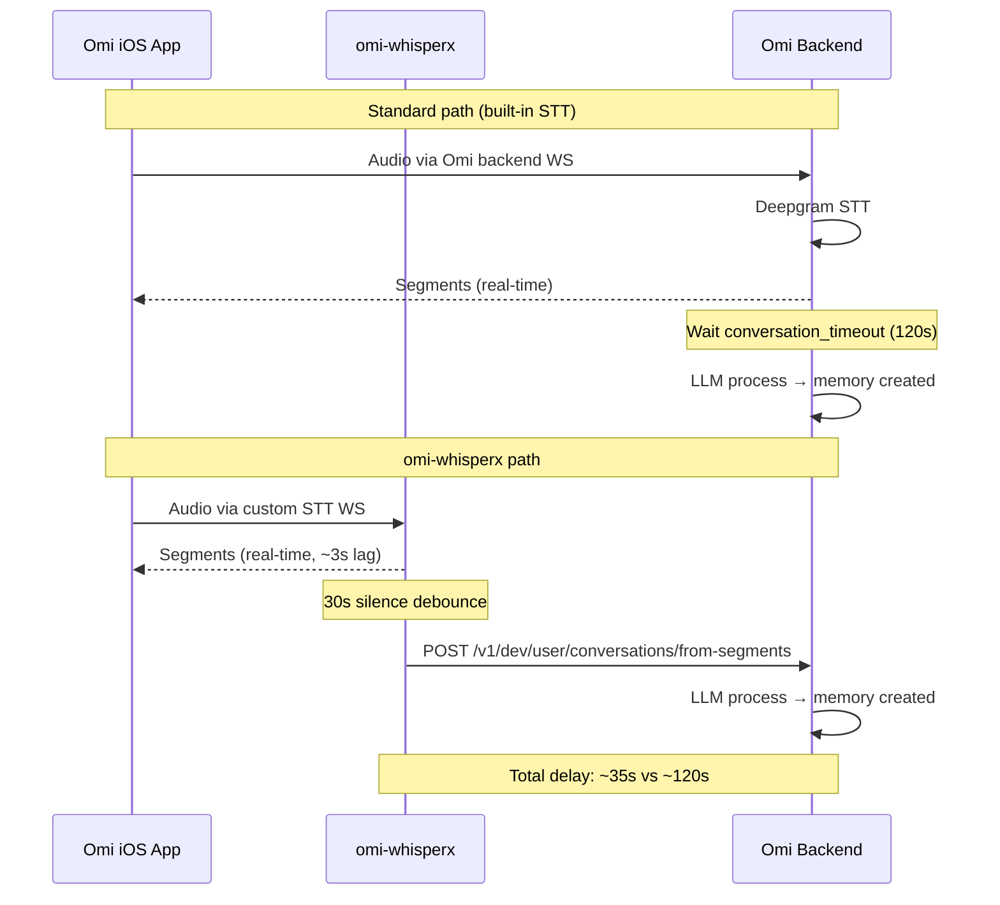

# omi-whisperx

> **Self-hosted, real-time speech-to-text for the [Omi](https://www.omi.me/) wearable** — powered by [WhisperX](https://github.com/m-bain/whisperX) with named speaker identification, direct Omi memory creation, and a live transcript dashboard.

No Omi subscription required. Runs on **Mac Apple Silicon**, **Raspberry Pi 5**, or any **Linux/CUDA** machine.

[](https://ghcr.io/rahulsharma0810/omi-whisperx)
[](LICENSE)

---

## Why

Omi's cloud STT costs money and sends your audio to third-party servers. This project replaces it entirely — your audio never leaves your machine, speaker names are resolved locally, and conversations are pushed directly to your Omi memory via the official API, bypassing the 2-minute conversation processing delay.

---

## Features

| | Feature |
|---|---|
| 🎙️ | **Real-time WebSocket STT** — streams from Omi pendant with ~2–4s lag |
| 👤 | **Named speaker identification** — "Rahul" instead of SPEAKER_00 |
| ⚡ | **Fast speaker ID** — resemblyzer embed (~0.1s) vs pyannote diarization (~15s) |
| 🧠 | **Direct Omi memory creation** — POSTs transcript to Omi API after 30s silence, no 2-min wait |
| 🚫 | **TV/movie voice filter** — blocks ambient entertainment audio from being saved as memories |
| 📱 | **Live transcript UI** — real-time dashboard at `/ui/live` with speaker colour coding |
| 🔊 | **Voice enrollment UI** — listen to unknown clips, assign names in one click |
| 🏋️ | **Benchmark tool** — per-stage RTF measurement, hardware comparison |
| 🐳 | **Multi-arch Docker** — arm64 (Raspberry Pi) + amd64 (Linux/CUDA) |
| 🔔 | **Push notifications** — ntfy.sh alerts for pipeline events |

---

## How It Works

### End-to-End Flow



### Speaker Identification Pipeline



### Omi Memory Pipeline (bypassing 2-min timeout)



---

## Quick Start

### 1. Prerequisites

- Python 3.12
- `ffmpeg` + `libsndfile1`
- [HuggingFace token](https://huggingface.co/settings/tokens) — accept [pyannote/speaker-diarization-3.1](https://huggingface.co/pyannote/speaker-diarization-3.1) license
- Omi API key — from [Omi Developer Settings](https://app.omi.me/apps)

### 2. Clone & configure

```bash
git clone https://github.com/Rahulsharma0810/omi-whisperx
cd omi-whisperx
cp .env.example .env
# Edit .env — set HF_TOKEN and OMI_API_KEY at minimum
```

### 3. Start

```bash
./start.sh
```

Creates `~/.venvs/whisperx`, installs deps, launches on **:8080**. First start downloads models (~2–4 GB).

### 4. Expose publicly

Omi pendant needs HTTPS. Use [Cloudflare Tunnel](https://developers.cloudflare.com/cloudflare-one/connections/connect-apps/):

```bash
cloudflared tunnel run --url http://localhost:8080
```

### 5. Configure Omi iOS app

In Omi → Settings → Developer → **Cloud Provider > Custom**:

| Field | Value |
|---|---|
| WebSocket URL | `wss://your-domain.com/live` |
| Sample Rate | `16000` |
| Language | `en` (or leave blank for auto-detect) |

Enable **VAD Gate** in Omi app settings for best performance (strips silence before sending).

---

## Docker

```bash
docker run -d \
  --name omi-whisperx \
  -p 8080:8080 \
  -e HF_TOKEN=hf_... \
  -e OMI_API_KEY=omi_dev_... \
  -e WHISPER_MODEL=small \
  -v ~/.omi:/data \
  ghcr.io/rahulsharma0810/omi-whisperx:latest
```

### Docker Compose

```yaml
version: "3.9"
services:
  omi-whisperx:
    image: ghcr.io/rahulsharma0810/omi-whisperx:latest
    restart: unless-stopped
    ports:
      - "8080:8080"
    environment:
      HF_TOKEN: hf_your_token
      OMI_API_KEY: omi_dev_your_key
      OMI_USER_NAME: "Your Name"       # marks your segments as is_user=true
      WHISPER_MODEL: small             # tiny|base|small|medium|large-v2
      WHISPER_BATCH_SIZE: "4"          # use 4 on Raspberry Pi 5
      SPEAKER_THRESHOLD: "0.85"
      FAST_SPEAKER: "true"             # resemblyzer (~0.1s) vs pyannote (~15s)
      TRUST_CLIENT_VAD: "true"         # use Omi VAD Gate, skip server VAD
    volumes:
      - omi_data:/data
volumes:
  omi_data:
```

---

## Web UI

| URL | Description |
|---|---|
| `/ui/live` | **Live transcript** — real-time segments with speaker colours, lag metrics |
| `/ui` | **Pipeline monitor** — SSE stream of every inference stage |
| `/ui/speakers` | **Speaker manager** — listen to unknown clips, assign names, enroll, block |
| `/benchmark` | **Benchmark** — per-stage RTF, hardware comparison |
| `/health` | System status — model, devices, speaker count, config |

### Live Transcript (`/ui/live`)

[ View interactive diagram →](https://excalidraw.com/#json=V3EOChdkm_X9jgqPCIT_7,MDTeu-BnUkIWVeQRDGrLAw)

Segments stream in real time with speaker name, colour coding, and lag metrics:
```
audio@+2.3s → sent@+5.1s | lag=2.8s (queue=0.0s proc=2.8s)
```

---

## Speaker Enrollment

Three ways to teach the system who's speaking:

### 1. Auto-capture → assign in UI
Every unknown voice is saved as a short clip (max 5 per unique voice). Go to `/ui/speakers`, play each clip, type a name, click **Confirm**. Done.

### 2. Upload audio
```bash
curl -X POST http://localhost:8080/speakers \
  -F "name=Alice" \
  -F "file=@alice_voice.m4a"
```

### 3. Record in browser
Open `/ui/speakers` → click the mic icon next to any name → speak for 5s → auto-enrolled.

### Blocking TV/movie voices
Unknown voices from TV/movies appear in clips. Click **Block** on any clip → that voice is permanently ignored and never recorded again. Uses embedding similarity so it works even if the audio quality changes.

---

## Configuration Reference

All settings via environment variables. See `.env.example` for the full list.

### Core

| Variable | Default | Description |
|---|---|---|
| `WHISPER_MODEL` | `small` | `tiny` `base` `small` `medium` `large-v2` |
| `WHISPER_BATCH_SIZE` | `16` | Lower to `4` on Raspberry Pi 5 |
| `HF_TOKEN` | — | **Required** — HuggingFace token |

### Speaker Identification

| Variable | Default | Description |
|---|---|---|
| `FAST_SPEAKER` | `true` | `true` = resemblyzer (~0.1s), `false` = pyannote (~15s) |
| `SPEAKER_THRESHOLD` | `0.85` | Cosine similarity cutoff. Higher = stricter matching |
| `PROFILES_DIR` | `~/.omi/speakers` | Speaker embedding storage |
| `RECORDINGS_MAX_AGE_DAYS` | `7` | Auto-expire unknown clips after N days |

### Live WebSocket

| Variable | Default | Description |
|---|---|---|
| `TRUST_CLIENT_VAD` | `true` | Trust Omi VAD Gate — skip server-side VAD, flush on 0.5s frame gap |
| `SKIP_LIVE_ALIGN` | `true` | Skip word-level alignment in WS path (saves ~2s, not needed for Omi) |
| `MAX_QUEUE_AGE` | `30` | Drop queued utterances older than N seconds |

### Omi API Integration

| Variable | Default | Description |
|---|---|---|
| `OMI_API_KEY` | — | Omi developer API key — enables direct conversation creation |
| `OMI_USER_NAME` | — | Your name as enrolled speaker — marks your segments `is_user=true` |
| `OMI_CONV_DEBOUNCE` | `30` | Seconds of silence before POSTing conversation to Omi API |
| `OMI_API_BASE` | `https://api.omi.me/v1/dev/user` | Omi API base URL |

### Content Filter (optional)

| Variable | Default | Description |
|---|---|---|
| `CONTENT_FILTER` | `false` | Enable two-tier entertainment filter |
| `NLI_ENABLED` | `false` | Tier 1: zero-shot NLI classifier |
| `NLI_THRESHOLD` | `0.85` | Confidence cutoff — below escalates to Ollama |
| `OLLAMA_ENABLED` | `false` | Tier 2: Ollama LLM fallback |
| `OLLAMA_URL` | `http://localhost:11434` | Ollama server |
| `OLLAMA_MODEL` | `deepseek-v3.1:671b-cloud` | Ollama model name |

---

## API Reference

### WebSocket `/live`

Real-time STT for Omi pendant.

**Query params:** `language`, `uid`, `sample_rate` (default `16000`), `codec` (default `opus`)

**Omi sends:** Binary PCM16 frames (640 bytes = 20ms at 16kHz) + JSON control messages (`{"type": "CloseStream"}`)

**Server sends:**
```json
{
  "segments": [
    {
      "text": "Hello world",
      "speaker": "Rahul Sharma",
      "start": 0.0,
      "end": 2.4
    }
  ]
}
```

### `POST /inference`

HTTP transcription endpoint (Omi Transcript Provider mode).

```bash
curl -X POST http://localhost:8080/inference \
  -F "file=@audio.wav" \
  -F "language=en" \
  -F "response_format=verbose_json"
```

Response:
```json
{
  "segments": [{"start": 0.0, "end": 2.4, "text": "Hello", "speaker": "Rahul"}],
  "text": "Hello",
  "language": "en",
  "duration": 5.2
}
```

### Speaker API

| Method | Path | Description |
|---|---|---|
| `GET` | `/speakers` | List enrolled speakers |
| `POST` | `/speakers` | Enroll — `name` + `file` form fields |
| `PATCH` | `/speakers/{name}` | Rename |
| `DELETE` | `/speakers/{name}` | Delete profile |
| `GET` | `/speakers/recordings` | List unknown clips with similarity scores |
| `POST` | `/speakers/recordings/{id}/assign` | Assign name → enroll |
| `POST` | `/speakers/recordings/{id}/block` | Block voice permanently |
| `DELETE` | `/speakers/recordings/{id}` | Discard clip |
| `POST` | `/speakers/recordings/purge` | Delete clips that now match enrolled speakers |
| `GET/DELETE` | `/speakers/blocked` | View / clear blocked voices |

### SSE Events (`/events`)

| Event | When | Key fields |
|---|---|---|
| `ws_connected` | Pendant connects | `uid`, `lang` |
| `ws_audio` | First audio frame | `frame_bytes` |
| `ws_transcript` | Utterance processed | `segments`, `lag` |
| `ws_disconnected` | Pendant disconnects | `frames` |
| `audio_received` | HTTP inference start | `chunk_id`, `size_kb` |
| `transcribed` | After WhisperX | `chunk_id`, `lang`, `segments` |
| `transcript` | Inference complete | `chunk_id`, `duration`, `segments` |

---

## Raspberry Pi 5 Setup

```bash
sudo apt-get install -y python3.12 python3.12-venv ffmpeg libsndfile1
python3.12 -m venv ~/.venvs/whisperx
source ~/.venvs/whisperx/bin/activate
pip install torch torchaudio --index-url https://download.pytorch.org/whl/cpu
pip install -r requirements.txt

# Recommended .env for RPi5
WHISPER_MODEL=base
WHISPER_BATCH_SIZE=4
FAST_SPEAKER=true
TRUST_CLIENT_VAD=true
SKIP_LIVE_ALIGN=true
```

Expect ~2–3s per utterance with `base` model on RPi5.

---

## Hardware Support

| Hardware | Whisper device | Diarization | Notes |
|---|---|---|---|
| Mac Apple Silicon | CPU + int8 | MPS | Best dev setup |
| Linux + CUDA | CUDA + float16 | CUDA | Fastest inference |
| Raspberry Pi 5 | CPU + int8 | CPU | Use `base`/`tiny` model |
| Linux CPU-only | CPU + int8 | CPU | Use `base`/`tiny` model |

> CTranslate2 (Whisper backend) and resemblyzer (speaker encoder) do not support MPS — CPU is used intentionally.

---

## Benchmarking

```bash
# Quick (no HF_TOKEN needed)
python benchmark.py --no-diarization --no-embedding --language en --trials 3

# Full pipeline on real audio
python benchmark.py audio.wav --trials 3 --output json --output-file results_mac.json

# Compare two machines
python benchmark.py --compare results_mac.json results_rpi5.json
```

Or use the interactive UI at `/benchmark`.

---

## launchctl (macOS background service)

```bash
# Install
cp com.rvs.whisperX.plist ~/Library/LaunchAgents/
launchctl load ~/Library/LaunchAgents/com.rvs.whisperX.plist

# Restart after config changes
launchctl unload ~/Library/LaunchAgents/com.rvs.whisperX.plist
launchctl load ~/Library/LaunchAgents/com.rvs.whisperX.plist

# Logs
tail -f ~/omi-whisperx/server.log
```

---

## Contributing

PRs and issues welcome.

**Do not:**
- Add MPS to WhisperX calls — CTranslate2 doesn't support it
- Add MPS to `VoiceEncoder` — resemblyzer doesn't support it
- Add pip deps without checking `aarch64` wheels exist (must run on RPi5)
- Make `classify_content()` synchronous — Ollama call is async HTTP
- Call NLI pipeline directly from async code without `asyncio.to_thread`

---

## License

MIT
